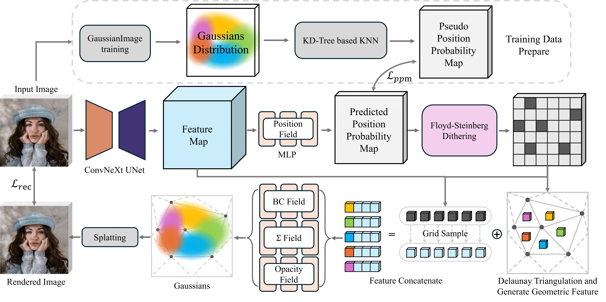
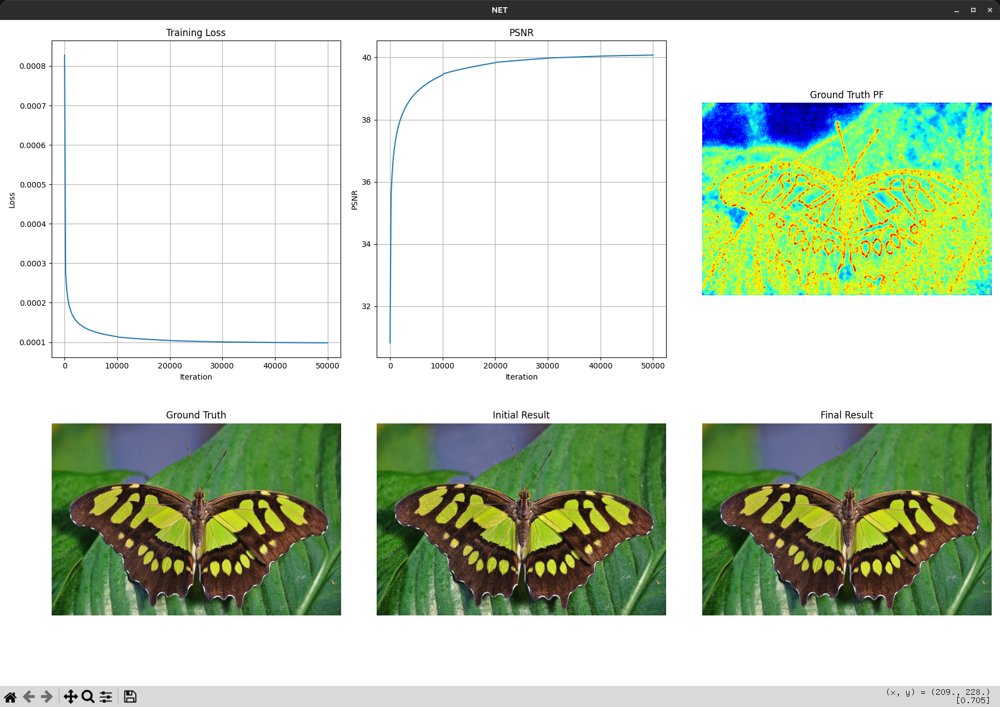

# Dev Vesion - Instant GaussianImage: A Generalizable and Self-Adaptive Image Representation via 2D Gaussian Splatting (ICCV'2025)
[](https://opensource.org/licenses/MIT) 
[](https://arxiv.org/abs/2506.23479)


This repository contains the official implementation of our paper [Instant-GI](https://arxiv.org/abs/2506.23479), which introduces a versatile and adaptive image representation framework utilizing 2D Gaussian Splatting ([GaussianImage](https://arxiv.org/abs/2403.08551)). GaussianImage leverages the rapid rendering capabilities of Gaussian Splatting within the realm of INR (Implicit Neural Rendering), distinguishing itself with superior rendering speed, compression efficiency, and reconstruction quality. Nonetheless, it faces certain challenges, such as the extended training time required to achieve satisfactory representation and the need to predefine a fixed number of Gaussians per image, rather than dynamically adjusting based on the image's information entropy. Our approach addresses these issues by enhancing these aspects to make GaussianImage more practical. For a comprehensive understanding of our methodology, please refer to our paper.

## Dev Note
This is a development version, which mainly replaces the `Delaunay` algorithm of the `scipy` version with the GPU version of `Delaunay` from `cupy` compared to the `master` branch version. For details, you can refer to the modifications in the `generalizable_model/ellipse_process.py` file. It is worth mentioning that there are certain differences between the triangulation algorithms of the two. Specifically, the original `scipy` version's algorithm performs slightly better, almost requiring no filtering of the triangulated triangles, whereas the `cupy` version may have more or less non-compliant triangles, so some filtering strategies have been added. Moreover, there is a bug in the `neighbor` calculation in the `cupy` version `14.0.0a1`, and the `neighbor` is manually calculated in the code. To run this version, you need to install the `cupy` library version `14+`.

```bash
pip install cupy-cuda12x --pre -U -f https://pip.cupy.dev/pre
```
I also tested the difference in initialization scores between the two.

DIV2K x2:

| Method              | Gaussian Num |  PSNR   | Init Time (seconds) |
| :------------------ | :----------: | :-----: | :-----------------: | 
| CPU Version (scipy) |   76985.22   | 29.6688 |       0.4269        |
| GPU Version (cupy)  |   76698.35   | 27.0650 |       0.2971        |

Kodak:

| Method              | Gaussian Num |  PSNR   | Init Time (seconds) |
| :------------------ | :----------: | :-----: | :-----------------: |
| CPU Version (scipy) |   42858.08   | 29.6764 |       0.2503        |
| GPU Version (cupy)  |   42656.96   | 27.5285 |       0.2096        |

It can be observed that the number of Gaussians in the GPU version slightly decreased, and the time was also reduced. However, the initial PSNR significantly dropped. This is likely because I did not retrain the model, and there are certain differences in the triangulation results between the two, leading to a larger drop in PSNR.


## Overview
Implicit Neural Representation (INR) has demonstrated remarkable advances in the field of image representation but demands substantial GPU resources. GaussianImage recently pioneered the use of Gaussian Splatting to mitigate this cost, however, the slow training process limits its practicality, and the fixed number of Gaussians per image limits its adaptability to varying information entropy. To address these issues, we propose in this paper a generalizable and self-adaptive image representation framework based on 2D Gaussian Splatting. Our method employs a network to quickly generate a coarse Gaussian representation, followed by minimal fine-tuning steps, achieving comparable rendering quality of GaussianImage while significantly reducing training time. Moreover, our approach dynamically adjusts the number of Gaussian points based on image complexity to further enhance flexibility and efficiency in practice. Experiments on DIV2K and Kodak datasets show that our method matches or exceeds GaussianImage's rendering performance with far fewer iterations and shorter training times. Specifically, our method reduces the training time by up to one order of magnitude while achieving superior rendering performance with the same number of Gaussians.


<div>
  

  <sub align="left">**Overview of our Instant-GI pipeline.** Given an input image, we first extract a feature map using a ConvNeXt-based UNet. The Position Probability Map (PPM) is then predicted by an MLP-based Position Field and discretized via Floyd–Steinberg Dithering. The resulting points are structured using Delaunay Triangulation, from which geometric features are extracted. Gaussian attributes, including position, scaling, rotation, and opacity, are predicted through dedicated MLP fields (BC Field, Σ Field, and Opacity Field). The final Gaussians are rendered via splatting, supervised by the RGB loss L_rec to ensure reconstruction quality. Additionally, a pre-trained Gaussian representation from GI is used to generate a Pseudo PPM, which supervises position probability learning via L_ppm.</sub>
</div>


<div>
  

  <sub align="left">**Reconstruction Progress Visualization.** Each row sequentially shows the GT image, frequency spectrum, initialization results, and results at 2s, 10s, and 20s. The results compare Rand. Init (left) and Net. Init. (right).</sub>
</div>

## Quick Start

### Setup

Clone the repository and set up the conda environment:

```bash
git clone https://github.com/whoiszzj/Instant-GI.git
cd Instant-GI
conda create -n Instant-GI python=3.9
conda activate Instant-GI
pip install -r requirements.txt
mkdir checkpoints
```

### Data & Checkpoints

First, prepare a dataset such as [DIV2K](https://data.vision.ee.ethz.ch/cvl/DIV2K/) or [Kodak](https://www.kaggle.com/datasets/sherylmehta/kodak-dataset), or simply use a single image for a quick demo. Next, download our pretrained [checkpoint](https://drive.google.com/drive/folders/1lpgi6hq5oJjiPOT28wUWYm2oqZpq_Dcb?usp=drive_link) and place it in the `checkpoints` folder.

### Run a Simple Demo

1. Prepare an image, for example, `0829x2.png` from the `assets` folder.
2. Edit `general.yaml` in the `datasets` config folder, and set the `image_paths` field. This field accepts a list of image paths, allowing you to process multiple images at once.

```yaml
...
datasets:
  ...
  image_paths: ["./assets/0829x2.png"]
```

3. Run `train.py` with the following command:

```bash
python train.py --config ./datasets/general.yaml
```

4. The results will be saved in the `output` folder by default. The output structure is as follows:

```bash
./output
├── general  # dataset name
│   └── 0829x2  # image name
│       └── net  # initialization method
│           ├── gaussian_model.pth.tar   # gaussian model
│           ├── gt_pf.npy  # position probability map 
│           ├── gt.png  # ground truth image
│           ├── init.png  # initial result
│           ├── log.npy  # log file
│           ├── render.png  # gaussian rendered image
│           └── train.txt  # log file
└── train.txt  # log file
```

5. To easily visualize the output results, use `vis_log.py`:

```bash
python vis_log.py --data_dir ./output/general/0829x2
```

<div align='center'>
  
</div>

6. You can change the initialization method in `general.yaml` to `random` (random initialization) or `quard` (quad-tree initialization) to compare the results.

### Test on Kodak or DIV2K Datasets

1. Take `Kodak` as an example. Prepare the `Kodak` dataset:

```bash
./data/kodak
├── kodim01.png
├── kodim02.png
├── ...
├── kodim23.png
└── kodim24.png

1 directory, 24 files
```

We recommend creating a `data` directory and placing or linking all dataset files there.

2. Use `kodak.yaml` to train and evaluate the results:

```bash
python train.py --config ./datasets/kodak.yaml
```

If you have a wandb account, we recommend setting `wandb.activate` to `True` to record the training process. Other settings and outputs are the same as in the demo. More details about parameter settings can be found in the config file comments.

### Train Your Own Checkpoints

If you want to train your own initialization network, you can use your own dataset. Here's the workflow:

1. For example, using the DIV2K dataset, we generate training data for its `x2`, `x3`, and `x4` images. You can also download [our generated dataset](https://drive.google.com/file/d/1zMnND1_cPh1z9M-kv2xvxiPkpWh50-yX/view?usp=drive_link) for training and validation.

2. Use `train.py` and set `model.init_gaussians` to `quard` to use quad-tree initialization for each image. This will produce a trained Gaussian model and extract the position probability map for each image (`gt_pf.npy` in the output folder).

3. Use a simple script to collect all results into one folder, organized as follows:

```bash
./div2k_gs
├── train
│   ├── 0001x2
│   │   ├── gt_pf.npy 
│   │   └── gt.png
│   ├── 0001x3
│   ├── 0001x4
│   ├── 0002x2
│   ├── 0002x3
│   ├── 0002x4
│   ├── ...
│   ├── 0800x2
│   ├── 0800x3
│   └── 0800x4
└── valid
    ├── 0801x2
    │   ├── gt_pf.npy
    │   └── gt.png
    ├── 0801x3
    ├── 0801x4
    ├── 0802x2
    ├── 0802x3
    ├── 0802x4
    ├── ...
    ├── 0899x2
    ├── 0899x3
    └── 0899x4
```

You only need the `gt_pf.npy` and `gt.png` files; the others can be removed. Each image is trained for 50,000 iterations to ensure the Gaussian decomposition process converges.

4. Then, use `train_init_net.py` to start training:

```bash
python train_init_net.py --config ./datasets/div2k_train_init_net.yaml
```

In this config file, you can set your `train/valid_dir`.

5. Wait for the training process to complete.


## Acknowledgments
Thanks to the following open-source libraries, among others, for their assistance with our code:
1. [GaussianImage](https://github.com/Xinjie-Q/GaussianImage)
2. [ConvNeXt](https://github.com/facebookresearch/ConvNeXt)
3. [torch_kdtree](https://github.com/thomgrand/torch_kdtree)


## Citation
If you find our work useful or relevant to your research, please kindly cite our paper:
```
@InProceedings{Zeng_2025_ICCV,
    author    = {Zeng, Zhaojie and Wang, Yuesong and Yang, Chao and Guan, Tao and Ju, Lili},
    title     = {Instant GaussianImage: A Generalizable and Self-Adaptive Image Representation via 2D Gaussian Splatting},
    booktitle = {Proceedings of the IEEE/CVF International Conference on Computer Vision (ICCV)},
    month     = {October},
    year      = {2025}
}
```


## BUG?
This library is maintained by an individual, and there may be some bugs. If you encounter any bugs during use, you are very welcome to submit a pull request.

